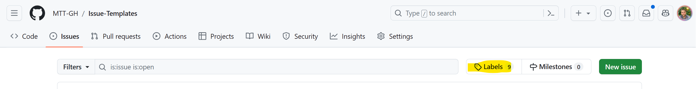
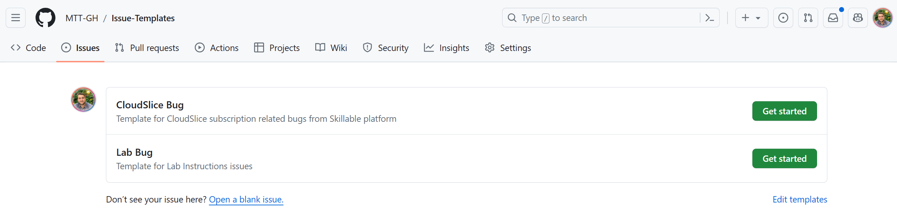

# Issue-Templates
Simple repository with two issue templates for MTT Courseware repositories. 

## Guidelines

1. Create a new GitHub Issue Label called "Skillable" (it will be used by one of the templates)
    
    - Go to **Issues** > **Labels**

        

    - Write **CloudSlice** as label name, choose a color (for example #82CA4D)

        

2. Copy the two templates under **.github/ISSUE_TEMPLATE** and paste them under a directory with the same structure on your repository.

    Once you commit the change to the **main** (or master) branch you will see two Issue options will be given when clicking on creating new GH Issue.

    

